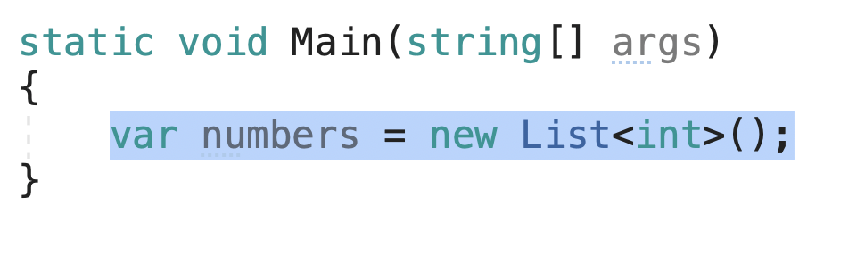
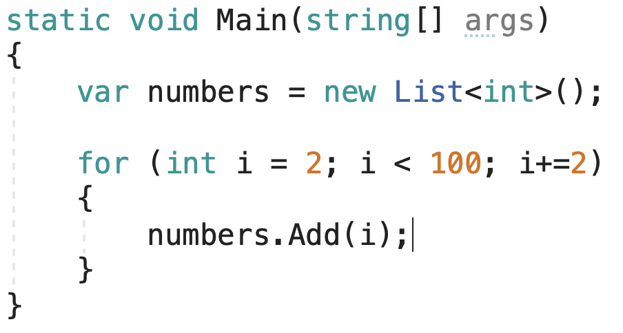
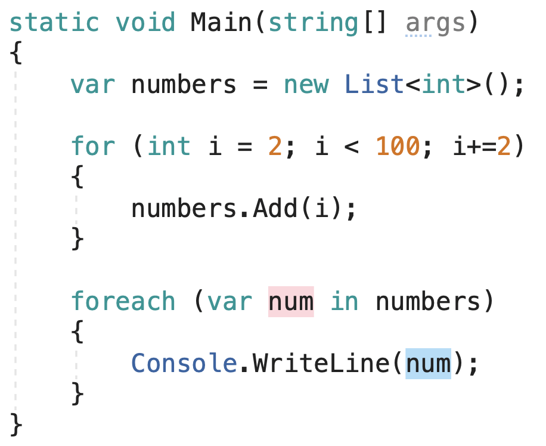
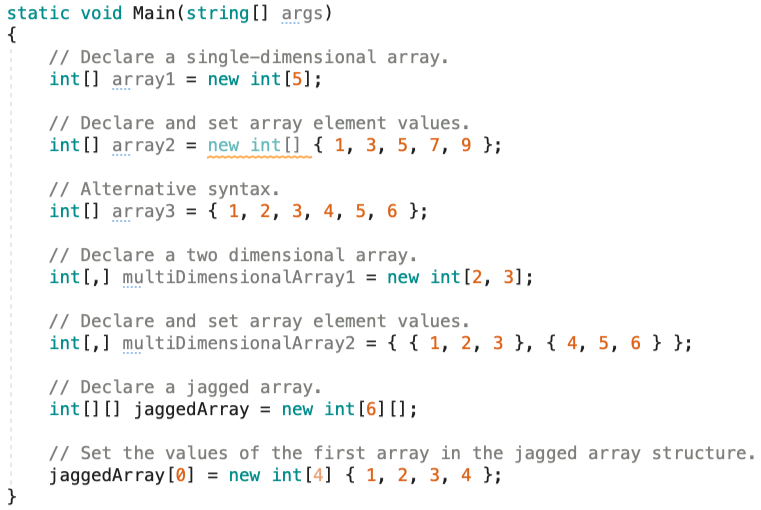
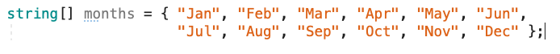
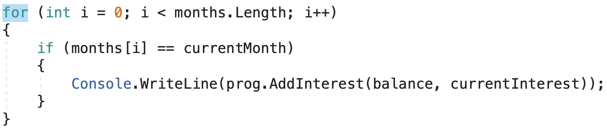

## Why

For many applications, you want to create and manage groups of related objects. There are two ways to group objects: by creating arrays of objects, and by creating collections of objects. Arrays are most useful for creating and working with a fixed number of strongly-typed objects. Collections provide a more flexible way to work with groups of objects. Unlike arrays, the group of objects you work with can grow and shrink dynamically as the needs of the application change. For some collections, you can assign a key to any object that you put into the collection so that you can quickly retrieve the object by using the key.

---

## What

A collection is a class, so you must declare an instance of the class before you can add elements to that collection. If your collection contains elements of only one data type, you can use one of the classes in the System.Collections.Generic namespace. A generic collection enforces type safety so that no other data type can be added to it. When you retrieve an element from a generic collection, you do not have to determine its data type or convert it.

Lets take a look at lists:

First we access the namespace needed to use Lists.


Afterwards, we declare a List ```<T>```

We’ll make a List of type int and name it “numbers”.



Now we can add integers to the List using a “for” loop. With this setup, we’ll add only even numbers up to 100 to our List. We do this by calling an Add() method:



Now we can add integers to the List using a “for” loop. With this setup, we’ll add only even numbers up to 100 to our List. We do this by calling an Add() method:



Afterwards we can display our List to the console using a “foreach” loop, with Console.WriteLine() in the body:



Our List displays up to 98, because our conditional is set to “less than”, not
“less than or equal to”.

---
Now Let's get a basic understanding of arrays:



To use Arrays, we don’t have to use another namespace other than “using System;”

## How

Let’s take a look at our Banking Application. We can create collections of months days to determine accounts that accumulate interest on a quarterly cycle. ( This will become more advanced as the course continues).

We can use an array since there are a fixed number of Months in every year:


Then by using a for loop with a nested if statement, we can determine if the month at index “i” is equal to the current month, we want to call our AddInterest() method



---

## Exercise

* First, fork the repository from <https://github.com/nrice41593/>

* Add me as the collaborator

* Then, clone the repo onto your personal machine and follow the instructions in the Project.

* When finished, push your project back up to GitHub and mark the assignment as complete in Google Classroom.

## Quiz

<https://docs.google.com/forms/d/1okEnXJK3PTmM2CRPZQIlVPhglfk_jynfSEF_OXt86-w/edit>
