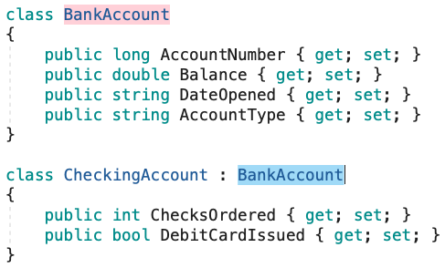
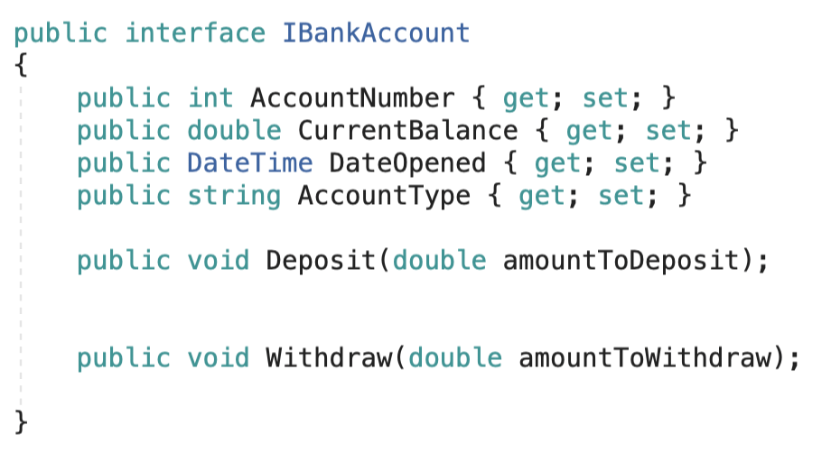
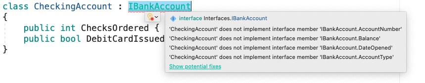
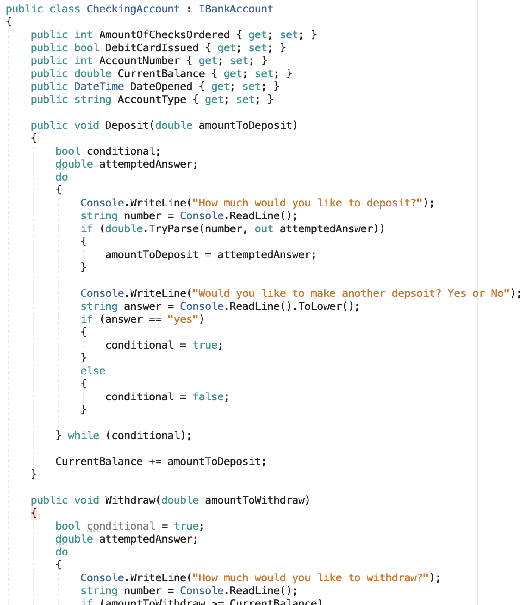
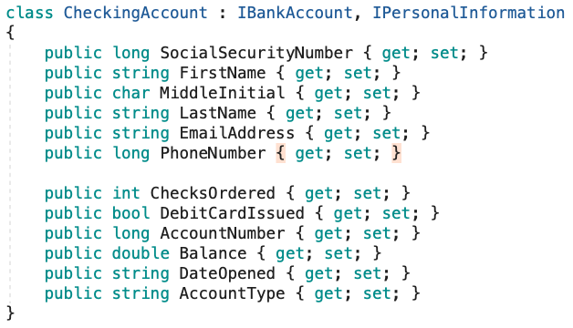

## Why

Interfaces in C # provide a way to achieve runtime polymorphism. What is runtime polymorphism? By runtime polymorphism, we can point to any derived class from the object of the base class at runtime that shows the ability of runtime binding. In Object-oriented languages like C#, we can use pointers to achieve runtime polymorphism. Using interfaces we can invoke functions from different classes through the same Interface reference, whereas using virtual functions we can invoke functions from different classes in the same inheritance hierarchy through the same reference. Before things start getting difficult let me start using simple and short examples to explain the concept of interfaces.

---

## What

By using interfaces, you can, for example, include behavior from multiple sources in a class. That capability is important in C# because the language doesn't support multiple inheritances of classes.

When a class or struct implements an interface, the class or struct must provide an implementation for all of the members that the interface defines. The interface itself provides no functionality. However, if a base class implements an interface, any class that's derived from the base class inherits that implementation.

**Remember: An interface does not care about the implementation. It merely requires that it is implemented.**

---

## How

* Let’s consider the previous lesson with inheritance, we had a base class called “BankAccount” and a derived class called “CheckingAccount” that inherited from our base class.

* By changing the BankAccount class to an interface called “IBankAccount” (interface naming convention requires a capital I in front of the class name”), we’ve put a safeguard in place stating that whenever a checking account is created it will be required to have these members.

* If you notice below, that we are throwing an error, this is because our ***CheckingAccount*** does not have the interface members and methods that are required per our “contract” with ***IBankAccount***

* We fix this by implementing the interface members and methods within our ***CheckingAccount*** class

* A class can also conform to multiple interfaces:

* Within large companies and large projects, this is how good quality and consistent code are implemented, thus creating a form of quality assurance.

---

## Exercise

* First, fork the repository from <https://github.com/nrice41593/InterfaceExercise>

* Add me as a collaborator

* Then, clone the repo onto your personal machine and follow the instructions in the Project.

## Quiz

<https://docs.google.com/forms/d/1Z_Q2ye7Xl9-Yr8kum3B1mgqpVxkbf9ePRIwPDD27rp0/edit>
