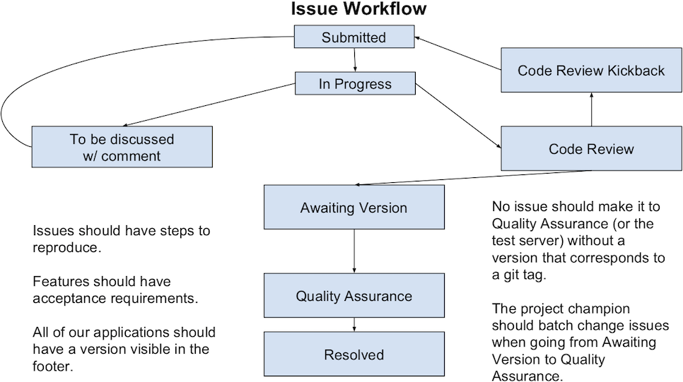
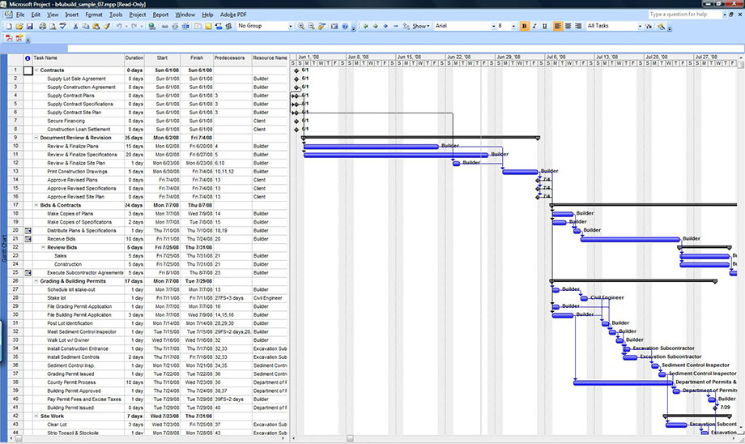
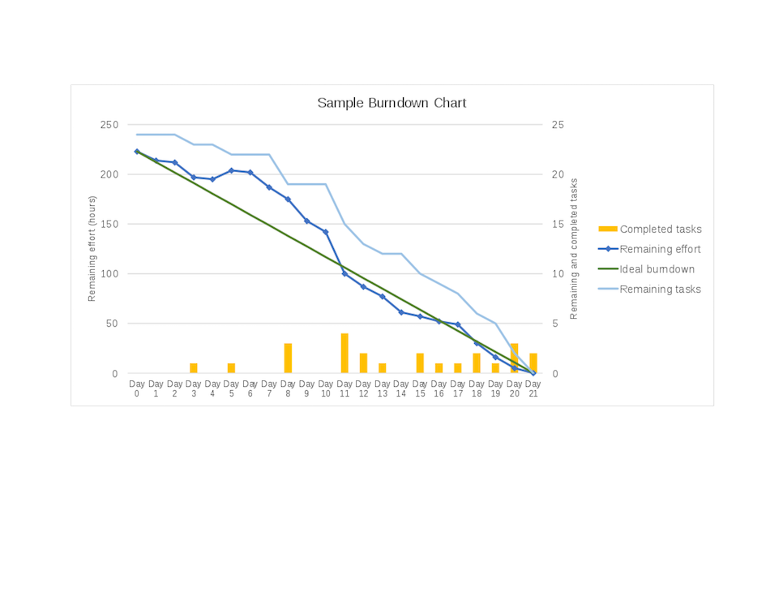

## Issue Trackers

Issue Trackers are systems that track an issue over their life cycle. All issue trackers tend to have at least one thing in common: they track the issue based on State/Status.

Every organization will have some slight variations to the process, but generally speaking, they conform pretty closely to the following state diagram:

## Waterfall

Waterfall is a legacy software methodology that requires an immense amount of planning prior to execution, where virtually every detail must be decided and estimated before beginning.

## Agile

Agile is a process that acknowledges that software is an ever evolving and changing thing and any attempt to deny that is either limiting or too rigid to adapt to changing business needs and requirements. There are subsets of agile that attempt to further define the process.

### Scrum

While the variants of agile are many, Scrum is the generally accepted methodology in one form or another. Let's watch a [cartoon about Scrum](https://www.youtube.com/watch?v=kYajjGi5-qM).

### User Stories

User stories always start with:

> As a(n) `role`, I want to...

For example:

> As an Administrator, I would like to see a report indicating the current state of the production.

After the user stories are completed, they are broken out and expanded with "Acceptance Criteria". These acceptance criteria are all the things that are required in order to consider this story delivered, and they operate as guidelines for Quality Assurance (QA) to utilize in order to develop their test script. They are also guidelines for the developer to develop their unit tests!

### Backlog

This is where all the ideas in the forms of User Stories are collected. The product owner select from these items to create the Sprint. A Sprint is a collection of User Stories / Issues designed to produce a releasable version of the software.

This will be versioned, and, in most cases, released to production after the Quality Assurance process has passed off on all the User Stories.

### Burndown

Here is a sample burndown chart:

## Continuous Integration

Continuous Integration is predicated on the idea that software's responsibility is ultimately to deliver value back to the business, and the only way to do that is to get the software to production. This concept means that software is delivered immediately to production when certain Quality Assurance and unit tests are passing.

Amazon and Google are publishing to production thousands of times a day across all their products which allows for extremely rapid iteration.
This requires quite a bit of rigor with your build systems and automated unit testing.
