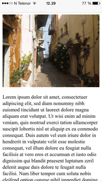

Make Your Web Apps Functional and Beautiful on Every Screen

## Introduction

What is responsive design?

Responsive Web Design makes your web page look good on all devices (desktops, tablets, and phones). Responsive Web Design is about using HTML and CSS to resize, hide, shrink, enlarge, or move the content to make it look good on any screen.

## Responsive Tips

Tips for Making Your Website Responsive

### Setting the Viewport

When making responsive web pages, you should include the following `<meta>` element:

```html
<meta name="viewport" content="width=device-width, initial-scale=1.0">
```

This will set the viewport of your page, which will give the browser instructions on how to control the page's dimensions and scaling. Here is an example of a web page without the viewport meta tag, and the same web page with the viewport meta tag:

Without the viewport meta tag:


With the viewport meta tag:



### Responsive Images

Responsive images are images that scale nicely to fit any browser size. There are a few different ways you can handle responsive images:

#### Using the Width Property

If the width property is set to 100%, the image will be responsive and scale up and down:

```html

```

#### Using the Max Width Property

Notice that in the example above, the image can be scaled up to be larger than its original size. If the max-width property is set to 100%, the image will scale down if it has to, but never scale up to be larger than its original size:

```html

```

#### Different Images Based on Browser Width

Notice that in the example above, the image height can be scaled, but the `max-width` has been set, so the width will never be greater than the image's container. The HTML `<picture>` element allows you to define different images for different browser window sizes:

```html
<picture>
  <source srcset="img_smallflower.jpg" media="(max-width: 600px)">
  <source srcset="img_flowers.jpg" media="(max-width: 1500px)">
  <source srcset="flowers.jpg">
  
</picture>
```

### Responsive Text Size

There are a number of ways to ensure responsive text. One way is with a `vw` unit, which stands for "viewport width". That way the text size will follow the size of the browser window:

```html
<h1 style="font-size:10vw">Hello World</h1>
```

### Media Queries

In addition to resize text and images, it is also common to use media queries in responsive web pages. With media queries you can define completely different styles for different browser sizes.

View the Media Queries section of [this page](https://www.w3schools.com/html/html_responsive.asp) for more details and examples, or view this [RWD Tutorial](https://www.w3schools.com/css/css_rwd_intro.asp).

### Responsive Web Page Example

View this [Responsive Web Page Example](https://www.w3schools.com/html/tryit.asp?filename=tryhtml_responsive_media_query3), complete with code.
